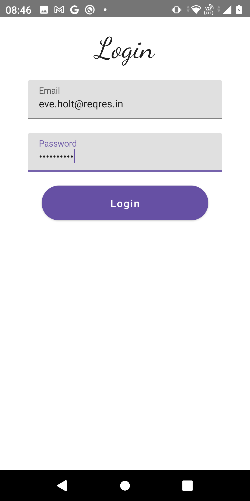
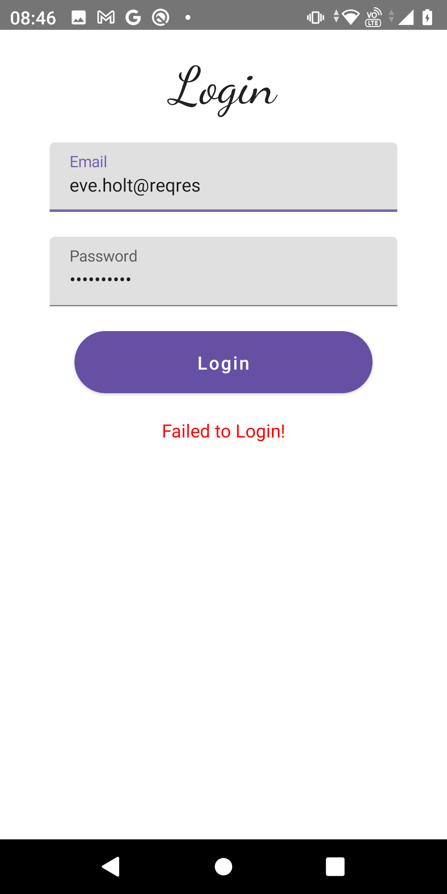
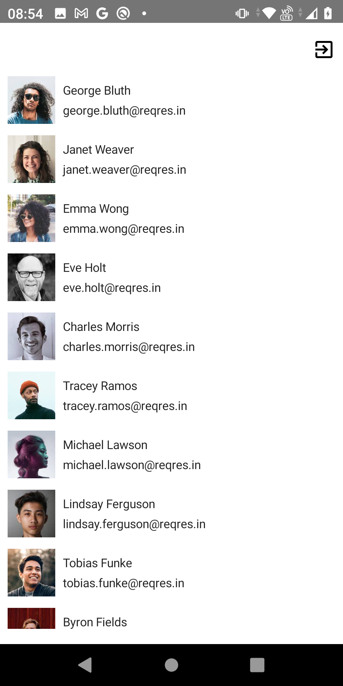

<h1 align="center">Reqres Login</h1>
<h3 align="center">An Android Login Sample Application</h3>
 

## About
Reqres Login uses reqres API to allow you to perform login and see user lists.

## What was used
- Kotlin
- MVVM Design pattern
- reqres API
- Jetpack Compose
- Dagger-Hilt

## Screenshots

## Author
* <b>Nabila Fakhirah</b>
* Email: nabilafakhirah@gmail.com
   